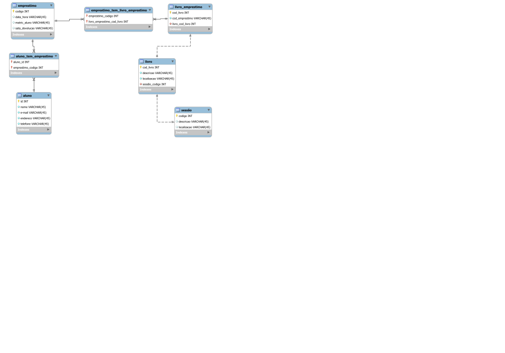

# DB_Escola
Criação de meu primeiro MySQL(Simples mais original)

Esta é minha primeira atividade com MySQL curso Front-End pela Proz.

Criei um Bano de Dados chamado Mydm.

Utilizei o Diagrama para criação e depois conectei(Estou testando ainda).

A ferramenta utilizada foi o Software MySQL Workbench.

A ideia foi criar um banco de dados para os alunos pegarem livros na biblioteca, sendo assim foi criado as tabelas conforme diagrama importado do Workbench.

Nunca havia estudado banco de dados e por utilizar através de linha de comando achei muito interessante e animador o aprendizado.

O que mais gostei é a forma que criamos o banco de dados, pois precisamos utilizar o raciocínio lógico.

O raciocínio lógico é uma forma de nos destacarmos com qualidade e colocarmnos nossas ideias em prática. Bem motivador.

Imagem exportada do diagrama em SVG:

Imagem exportada em PNG:

Exportado PDF pelo MySQL Workbench:
