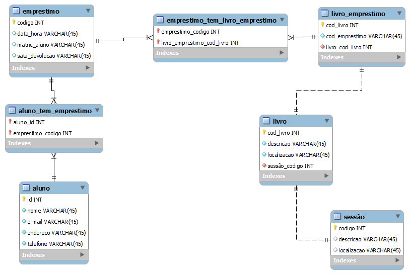

# DB_Escola
Criação de meu primeiro MySQL(Simples mais original)

Esta é minha primeira atividade com MySQL curso Front-End pela Proz.

Criei um Bano de Dados chamado Mydm.

Utilizei o Diagrama para criação e depois conectei(Estou testando ainda).

A ferramenta utilizada foi o Software MySQL Workbench.

A ideia foi criar um banco de dados para os alunos pegarem livros na biblioteca, sendo assim foi criado as tabelas conforme diagrama importado do Workbench.

Nunca havia estudado banco de dados e por utilizar através de linha de comando achei muito interessante e animador o aprendizado.

O que mais gostei é a forma que criamos o banco de dados, pois precisamos utilizar o raciocínio lógico.

O raciocínio lógico é uma forma de nos destacarmos com qualidade e colocarmnos nossas ideias em prática. Bem motivador.

Imagem exportada do diagrama em SVG:

Imagem exportada em PNG:

Exportado PDF pelo MySQL Workbench:

Chave Primária (Primary Key) e Chave Estrangeira (Foreign Key) são conceitos fundamentais em bancos de dados relacionais, desempenhando papéis importantes na organização e na integridade dos dados. Aqui está uma explicação mais detalhada de cada um desses conceitos:

1. Chave Primária (Primary Key):
   - Uma chave primária é um campo (ou um conjunto de campos) em uma tabela de banco de dados que serve para identificar exclusivamente cada registro na tabela.
   - A chave primária garante a unicidade dos valores em sua coluna ou conjunto de colunas associadas, o que significa que não pode haver dois registros com o mesmo valor na chave primária.
   - Além disso, a chave primária também garante a integridade referencial, permitindo que outras tabelas façam referência a ela por meio de chaves estrangeiras.
   - Uma tabela pode ter apenas uma chave primária, e geralmente é escolhida com base em um campo que tem significado único e é relevante para a aplicação.

2. Chave Estrangeira (Foreign Key):
   - Uma chave estrangeira é um campo (ou conjunto de campos) em uma tabela que estabelece uma relação com a chave primária de outra tabela.
   - A chave estrangeira é usada para manter a integridade referencial em um banco de dados, garantindo que os dados relacionados estejam consistentes.
   - Quando uma chave estrangeira é definida em uma tabela, ela normalmente faz referência à chave primária de outra tabela. Isso cria um relacionamento entre as duas tabelas.
   - As chaves estrangeiras são usadas para impor regras de consistência, como a restrição de que um registro em uma tabela filha não pode existir sem um registro correspondente na tabela pai (isso é conhecido como regra de cascata ou regra de exclusão).
   - Um banco de dados pode ter várias chaves estrangeiras, e elas são usadas para criar relacionamentos entre tabelas em um modelo de dados relacional.

Em resumo, a chave primária é usada para identificar exclusivamente os registros em uma tabela, enquanto a chave estrangeira é usada para criar relacionamentos entre tabelas e manter a integridade referencial nos dados. Juntas, essas duas chaves desempenham um papel fundamental na modelagem de dados e na garantia da consistência e integridade dos dados em um banco de dados relacional.